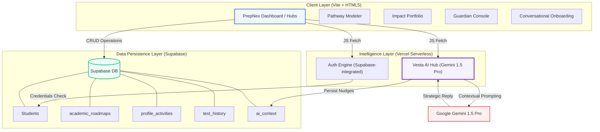

# PrepNex | Vesta Intelligence Architecture

PrepNex is an elite academic pathfinder that leverages advanced AI (Vesta) and a relational data layer to guide students through the complex journey of higher education admissions.

## High-Level Architecture

## Key Components

### 1. Vesta Intelligence Core
Vesta is the "Brain" of the platform. Unlike static chatbots, Vesta operates on a **Whole-Student Context** model. When a user interacts with Vesta, the system pulls:
- **Academic Rigor**: Current and planned courses from Grade 6-12.
- **Impact History**: Extracurricular activities, leadership roles, and community service.
- **Standardized Testing**: SAT/ACT trajectories.
- **Persona Context**: Strategic focus areas like "Ivy League Alignment."

### 2. The Pathway Modeler
A dynamic UI that allows students to visualize their 7-year trajectory. Each course added is validated against Vesta's data standards (STEM vs. Humanities tracks) and updates a real-time **Alignment Score**.

### 3. Parent Hub (Strategic Summary)
A specialized view for guardians that distills complex student data into high-level "briefings" generated by Vesta, focusing on critical action items and long-term milestones.

## Technical Stack
- **Frontend**: Vanilla JS (ES Modules), Vite, Lucide, Plus Jakarta Sans.
- **Backend**: Node.js Serverless Functions (Vercel).
- **AI**: Google Gemini API (1.5 Pro Model).
- **Database**: Supabase (PostgreSQL with Realtime capabilities).
- **Branding**: Official Aumtech "Light Tech" aesthetic (prep.aumtech.ai).
